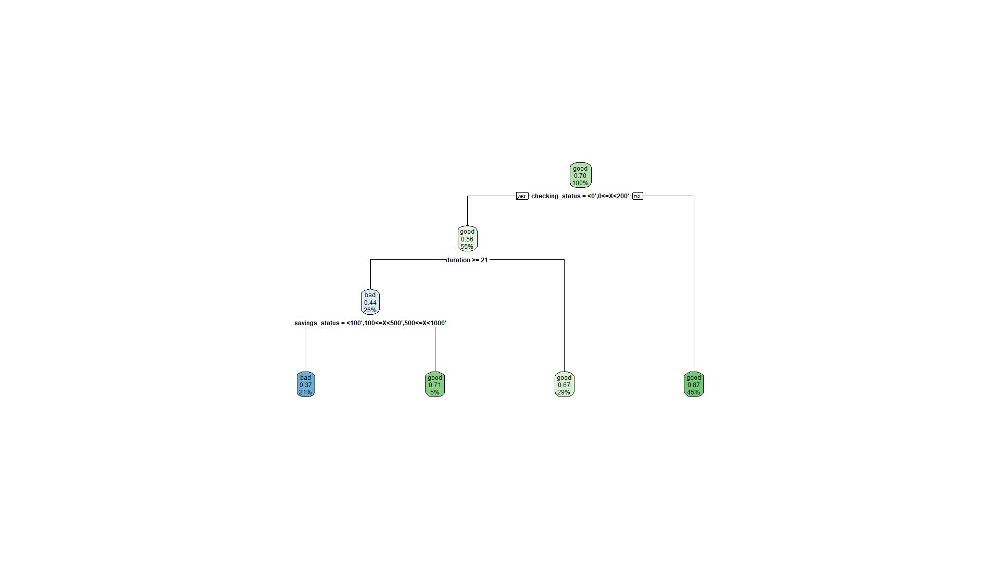

```{r}
library(tidyverse)
library(caret)
library(rpart)
library(rpart.plot)
library(randomForest)
library(glmnet) # backward criterion
library(jpeg)   # high-quality plotting
```


```{r}
credit <- read_csv("https://docs.google.com/spreadsheets/d/1jFkOKgD5NGeD8mDj_42oBNJfFVK42-1cMKk0JxVFxeA/gviz/tq?tqx=out:csv")
```
```{r}
glimpse(credit)
```
```{r}
credit <-  credit %>% mutate_if(is.character, as.factor)
glimpse(credit)
```

```{r}
# splitting into training and testing dataset
credit_split_70 = createDataPartition(credit$class, p = 0.7, list = FALSE)
credit_split_80 = createDataPartition(credit$class, p = 0.8, list = F)
training_70 = credit[credit_split_70,]
training_80 = credit[credit_split_80,]
test_70_features = credit[-credit_split_70, !(colnames(credit) %in% c('class'))]
test_70_target = credit[-credit_split_70, 'class']
test_80_features = credit[-credit_split_80, !(colnames(credit) %in% c('class'))]
test_80_target = credit[-credit_split_80, 'class']
```

```{r}
# create decision trees
credit_tree_70 = rpart(class ~ . , data = training_70)
credit_tree_80 = rpart(class ~ . , data = training_80)

```

70% training:

```{r}
credit_tree_70$variable.importance
jpeg(filename="credit_70.jpeg", width=1920, height = 1080)
rpart.plot(credit_tree_70)
dev.off()
```


Validate tree before pruning

```{r}
credit_tree_70_pred = predict(credit_tree_70, newdata = test_70_features)
pred_output_70_good = (credit_tree_70_pred[, "bad"] < 0.5)
test_target_good = test_70_target == "good"
credit_70_mse = mean(test_target_good != pred_output_70_good)
```

```{r}
# do this many times
# rate error of decision tree ()
times = 10
error_vect = as.numeric(length=times)

```


Prune tree

```{r}
credit_tree_70_pruned = prune(credit_tree_70, cp = 0.045)
jpeg(filename="credit_70_pruned.jpeg", width=1920, height = 1080)
rpart.plot(credit_tree_70_pruned)
dev.off()
```

